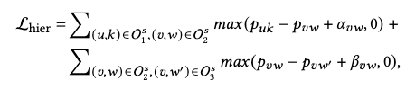
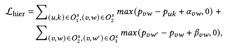

# SSD-ICGA
The PyTorch implementation of "Self-Supervised Denoising through Independent Cascade Graph Augmentation for Robust Social Recommendation"

## Requirements
The code has been tested running under Python 3.6.9. The required packages are as follows
- torch == 1.9.0
- numpy == 1.19.5
- pandas == 1.1.5

## Example to Run the code on Epinion
`python main.py --dataset Epinion`

## Note
### Correction to Formula in the Paper
We have identified a typo in Equation (5) presented in our paper. Specifically, the original formula is as follows:

The corrected formula is:

We sincerely apologize for this oversight in the paper. While the formula in the paper contains an error, we confirm that **the implementation in the provided code is correct and aligns with the corrected formula abo**ve.
